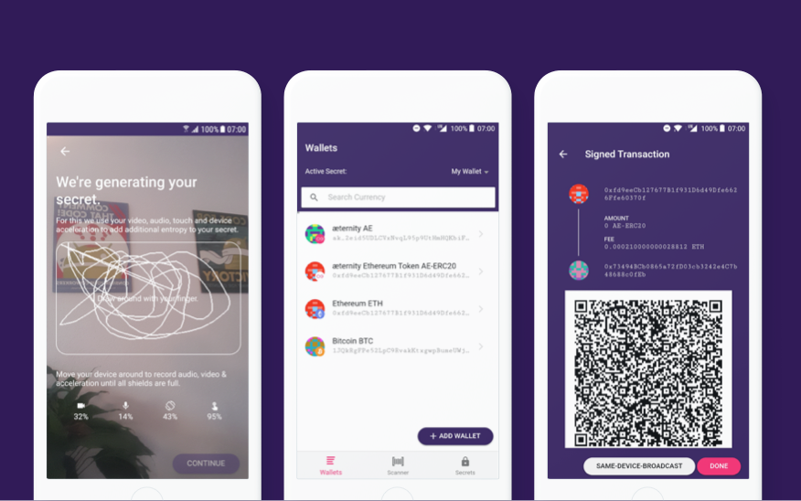

# AirGap Vault

<p align="left">
    
</p>

> Self custody made simple and secure. Protect your crypto and store your private keys offline.

[AirGap](https://airgap.it) is a crypto wallet system that lets you secure cypto assets with one secret on an offline device. The AirGap Vault application is installed on a dedicated device that has no connection to any network, thus it is air gapped. The [AirGap Wallet](https://github.com/airgap-it/airgap-wallet) is installed on your everyday smartphone.

## Description

AirGap Vault is responsible for secure key generation. Entropy from audio, video, touch and accelerometer are used together with the output of the hardware random number generator. The generated secret is saved in the secure enclave of the device, only accessible by biometric authentication. Accounts for multiple protcols can be created. Transactions are prepared by the AirGap Wallet and then transferred to the offline device via QR code, where it is signed and sent back to the Wallet using another QR code.

AirGap Vault is a hybrid application (using the same codebase for Android and iOS). Created using AirGap's protocol agnostic `airgap-coin-lib` library to interact with different protocols and our own secure storage implementation.

<p align="left">
    
</p>

## Download

- [Google Play](https://play.google.com/store/apps/details?id=it.airgap.vault)
- [App Store](https://itunes.apple.com/us/app/airgap-vault-secure-secrets/id1417126841?l=de&ls=1&mt=8)

## Features

- Secure secret generation with added entropy from audio, video, touch and device accelerometer
- Secure storage using the secure enclave of the device, accessible only by biometric authenticaiton
- Secure, one-way communication with AirGap Wallet over QR codes or URL-Schemes (app switching)
- Create accounts for all supported currencies like Aeternity, Bitcoin, Ethereum, Tezos, Cosmos, Kusama, Polkadot, Groestlcoin etc.
- Sign transactions offline without the secret ever leaving your device

## Security

The security concept behind air-gapped systems is to work with two physically separated devices, one of which has no connection to the outside world or any network. In the context of AirGap, the component which has no internet connection is the AirGap Vault. The two components, AirGap Vault and AirGap Wallet, communicate through one-way communication using QR codes.

### Key Generation

The entropy seeder uses the native secure random generator provided by the device and concatenates this with the sha3 hash of the additional entropy (audio, video, touch, accelerometer). The rationale behind this is:

- The sha3 hashing algorithm is cryptographically secure, such that the following holds: `entropy(sha3(secureRandom())) >= entropy(secureRandom())`
- Adding bytes to the sha3 function will never lower entropy but only add to it, such that the following holds: `entropy(sha3(secureRandom() + additionaEntropy)) >= entropy(sha3(secureRandom()))`
- By reusing the hash of an earlier "round" as a salt, we can incorporate the entire collected entropy of the previous round
- Native secure random cannot be fully trusted because there is no API to check the entropy pool it's using

The algorithm being used for the entropy seeding:

```typescript
const ENTROPY_BYTE_SIZE = 256
let entropyHashHexString = null

function toHexString(array) {
  return array
    .map(function (i) {
      return ('0' + i.toString(16)).slice(-2)
    })
    .join('')
}

function seedEntropy(additionalEntropyArray) {
  const secureRandomArray = new Uint8Array(ENTROPY_BYTE_SIZE)
  window.crypto.getRandomValues(secureRandomArray)
  console.log(entropyHashHexString + toHexString(secureRandomArray) + toHexString(additionalEntropyArray))
  entropyHashHexString = sha3_256(entropyHashHexString + toHexString(secureRandomArray) + toHexString(additionalEntropyArray))
  return entropyHashHexString
}
```

### Supply Chain Attacks

In the past years, mutliple cryptocurrency wallets have been targeted by attackers to try and steal users funds. One common attack vector is the supply chain attack. In this attack, the attacker tries to compromise a dependency that is used in the wallet and use it to inject malicious code. At AirGap, we take utmost care of evaluating the dependencies we use. We have also introduced a system that separates the dependencies used during testing and development from the dependencies that are used to build and run the project. This reduces the risk of malicious code injection during the build and test steps.

### Verifiable Builds

A very important property of any open source wallet is reprucibility. This means that executable that is downloaded from the Play Store or App Store can be exactly reproduced by compiling the open source code. If this is not the case, it means that there is hidden or removed code in the published version that is not visible in the published source code.

The project [WalletScrutiny](https://walletscrutiny.com/posts/it.airgap.vault/) examines a wide variety of cryptocurrency wallets to determine their reproducibility. We're happy to say that **AirGap Vault** was one of the first wallets to be marked as "reproducible".

### Security Audits

The application as a whole, as well as multiple components, have been audited by different third party companies.

**All audits have found no way of extracting the private key from AirGap Vault.**

The reports will be released once all the findings have been resolved.

## Build

First follow the steps below to install the dependencies:

```bash
$ npm install -g @capacitor/cli
$ npm install
```

Run locally in browser:

```bash
$ npm run start
```

Build and open native project

```bash
$ npm run build
$ npx cap sync
```

You can now open the native iOS or Android projects in XCode or Android Studio respectively.

```bash
$ npx cap open ios
$ npx cap open android
```

## Testing

To run the unit tests:

```bash
$ npm run install-test-dependencies
$ npm test
$ npm run install-build-dependencies
```

## Translations

We use [Transifex](https://www.transifex.com/) for the application translations.

If you want to contribute with translating the application you can do so by going to the [AirGap Transifex](https://explore.transifex.com/airgap/airgap/) page.

### Updating translations

To import the translations from Transifex to the application, first you will need to install the transifex-cli. You can do so by creating a directory of your choice and intalling in it the package globally by running:

```bash
curl -o- https://raw.githubusercontent.com/transifex/cli/master/install.sh | bash
```

You can now restart the terminal and check if it is installed by running:

```bash
tx --version
```

Every available language can be found in `src/assets/i18n/<lang>.json` where each json file corresponds to a different language. You can now import the updated translations from Transifex by running:

```bash
tx pull
```

This will update all the local translations with the updated ones automatically.

If you want to send new variables from the default language file to transifex, you can do so by running:

```bash
tx push
```

## Disclosing Security Vulnerabilities

If you discover a security vulnerability within this application, please send an e-mail to hi@airgap.it. All security vulnerabilities will be promptly addressed.

## Contributing

Before integrating a new feature, please quickly reach out to us in an issue so we can discuss and coordinate the change.

- If you find any bugs, submit an [issue](../../issues) or open [pull-request](../../pulls).
- If you want to integrate a new blockchain, please read the contributing guidelines in the [airgap-coin-lib](https://github.com/airgap-it/airgap-coin-lib) project.
- Engage with other users and developers on the [AirGap Telegram](https://t.me/AirGap).

## Related Projects

- [AirGap Wallet](https://github.com/airgap-it/airgap-wallet)
- [airgap-coin-lib](https://github.com/airgap-it/airgap-coin-lib)

- [AirGap Linux Distribution](https://github.com/airgap-it/airgap-distro)
- [apk-signer](https://github.com/airgap-it/airgap-raspberry-apk-signer)